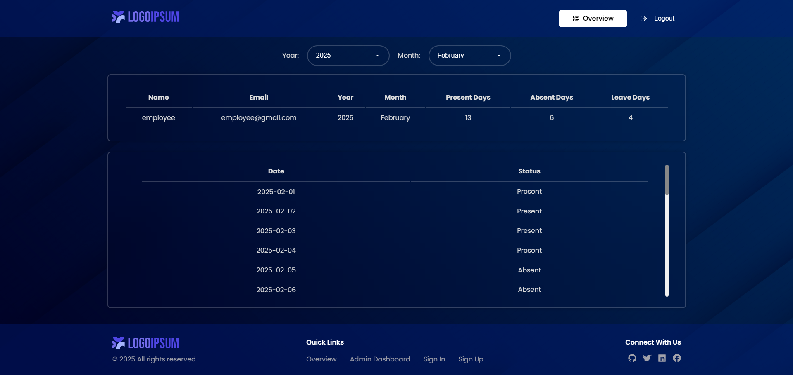

<div align="center">
  <br />
    <a href="#" target="_blank">
      
    </a>
  <br />

  <br />
  <div>
    
    
    
    
    
    
    
    
  </div>

  <h1 align="center">Employee Attendance System - MERN</h1>

   <div align="center">
     The Employee Attendance System is a web-based solution designed to track employee attendance and work hours efficiently. Built using React.js, HTML, CSS, and JavaScript for the frontend and powered by Node.js for the backend, it ensures seamless performance and scalability. The system supports MongoDB for secure and reliable data storage. Key features include user authentication and role management, employee check-in and check-out, automated work hour calculation, real-time attendance tracking, and comprehensive reporting with data visualization, making it a powerful tool for workforce management. 🚀
    </div>
</div>

## 📋 <a name="table">Table of Contents</a>

1. 🤖 [Introduction](#introduction)
2. ⚙️ [Tech Stack](#tech-stack)
3. 🔋 [Features](#features)
4. 📁 [Folder Structure](#folder-structure)
5. 🤸 [Quick Start](#quick-start)
6. 🚀 [Usage](#usage)
7. 🔗 [API Endpoints](#api-endpoints)
8. 🐞 [Troubleshooting](#troubleshooting)
9. ✨ [Contributing](#contributing)

## <a name="introduction">🤖 Introduction</a>

The Employee Attendance System is built with React.js, Node.js, and MongoDB to track attendance efficiently. Key features include user authentication, role management, check-in/out, automated work hour calculation, real-time tracking, and detailed reports, ensuring seamless workforce management and reducing manual workload.

## <a name="tech-stack">⚙️ Tech Stack</a>

- React JS
- JavaScript
- HTML5
- CSS3
- Node JS
- Express JS
- Nodemon
- MongoDB

## <a name="features">🔋 Features</a>

### Admin Features:

👉 Add, Edit, and Delete Employee Attendance

👉 View All Attendance Records for a Selected User

👉 Monthly Attendance Summary with Present, Absent, and Leave Days

👉 User Management (Add, View, and Update User Details)

👉 Secure Admin Access with Role-Based Authorization

### Employee Features:

👉 View Own Attendance Records

👉 Attendance Summary by Month and Year

### General Features:

👉 User Authentication (Login, Registration)

👉 Protected Routes using JWT Tokens

👉 Responsive UI for Desktop and Mobile Devices

## <a name="folder-structure">📁 Folder Structure</a>

```bash
Employee-Attendance-System-MERN/
├── backend/                            # Backend Directory (Node.js, Express, MongoDB)
│   ├── middleware/                     # Express Middlewares
│   │   └── auth.js                     # Authentication Middleware
│   ├── models/                         # Mongoose Models
│   │   ├── Attendance.js               # User Schema
│   │   └── User.js                     # Attendance Schema
│   ├── routes/                         # API Routes
│   │   ├── admin.js                    # Admin Routes
│   │   ├── attendance.js               # Attendance Routes
│   │   └── auth.js                     # Authentication Routes
│   ├── .env.example                    # Examples of Environment Variables
│   ├── .env.local                      # Environment Variables for backend
│   └── server.js                       # Express Server Configuration
├── frontend/                           # Frontend Directory (React.js)
│   ├── public/                         # Public Assets and Index.html
│   ├── src/                            # Source Code Folder
│   │   ├── assets/                     # All Project Assets
│   │   ├── components/                 # Reusable Components
│   │   │   ├── Navbar.css              # Styles for Navbar Component
│   │   │   └── Navbar.jsx              # Navigation Bar Component
│   │   ├── pages/                      # React Pages (Screens)
│   │   │   ├── AdminDashboardPage/     # Admin Dashboard for Attendance Management
│   │   │   │   ├── AdminDashboard.css  # CSS Styles for Admin Dashboard
│   │   │   │   └── AdminDashboard.jsx  # Admin Dashboard React Component
│   │   │   ├── LoginPage/              # USer Login for Attendance Management
│   │   │   │   ├── Login.css           # CSS Styles for User Login
│   │   │   │   └── Login.jsx           # User Login React Component
│   │   │   ├── OverviewPage/           # Attendance Details Overview
│   │   │   │   ├── Overview.css        # CSS Styles for Attendance Overview
│   │   │   │   └── Overview.jsx        # Attendance Details Overview React Component
│   │   │   └── RegisterPage/           # User Registration Page
│   │   │       ├── Register.css        # CSS Styles for User Registration
│   │   │       └── Register.jsx        # User Registration React Component
│   │   ├── App.js                      # Main React Component
│   │   ├── index.css                   # Global Styles
│   │   └── index.js                    # React DOM Renderer
│   ├── package-lock.json               # Packages & Dependencies
│   └── package.json                    # Project Installed Packages & Dependencies
└── nonRelatedAssets/                   # Assets for the GitHub Repo (Non-related to the Project)
```

## <a name="quick-start">🤸 Quick Start</a>

Follow these steps to set up the project locally on your machine.

**Prerequisites**

Make sure you have the following installed on your machine:

- [Git](https://git-scm.com/)
- [Node.js](https://nodejs.org/en)
- [npm](https://www.npmjs.com/) (Node Package Manager)

**Cloning the Repository**

```bash
git clone https://github.com/MenathNDGD/Employee-Attendance-System-MERN.git
cd Employee-Attendance-System-MERN
```

**Installation**

**Create a .env.local file in the backend folder**

```bash
PORT=5000
MONGO_URI=YOUR_MONGO_URI
JWT_SECRET=tu8861sRFQyXDRH
```

**Setup Backend**

```bash
cd backend
npx nodemon server.js
```

**Setup Frontend**

```bash
cd frontend
npm start
```

Open [http://localhost:3000](http://localhost:3000) in your browser to view the project.

## <a name="usage">🚀 Usage</a>

### Admin Login

- Use the login credentials of an Admin user.
- Access the Admin Dashboard to manage attendance.

### Employee Login

- Use employee login credentials.
- View personal attendance records.

### Admin Dashboard

- Select a user and view all attendance records.
- Add, Edit, or Delete attendance day by day.
- View monthly summaries for Present, Absent, and Leave days.

## <a name="api-endpoints">🔗 API Endpoints</a>

### Auth Routes

- **POST** `/api/auth/register`: Register a new user
- **POST** `/api/auth/login`: User login

### Attendance Routes

- **GET** `/api/attendance/:userId`: Get attendance by user
- **GET** `/api/attendance/summary/:userId`: Get attendance summary by month
- **POST** `/api/attendance`: Add attendance
- **PUT** `/api/attendance/:id`: Update attendance
- **DELETE** `/api/attendance/:id`: Delete attendance

### Admin Routes

- **GET** `/api/admin/users`: Get all users
- **PUT** `/api/admin/user/:id`: Update user details

## <a name="troubleshooting">🐞 Troubleshooting</a>

### 1. MongoDB Connection Error:

- Ensure your IP is whitelisted in MongoDB Atlas.
- Double-check your `MONGO_URI` in the `.env.local` file.

### 2. CORS Errors:

- Check `cors()` configuration in `backend/server.js`.

### 3. Invalid Token Error:

- Make sure to clear `localStorage` and log in again:

```javascript
localStorage.removeItem("token");
```

## <a name="contributing">✨ Contributing</a>

### 1. Fork the repo.

### 2. Create a new branch:

```bash
git checkout -b feature-name
```

### 3. Make your changes.

### 4. Commit your changes:

```bash
git commit -m 'Add some feature'
```

### 5. Push to the branch:

```bash
git push origin feature-name
```

### 6. Open a Pull Request.

**Feel free to tailor these contents according to your specific preferences or any additional details you want to include!**

- **Contributions:** Contributions are welcome! Feel free to fork the repository, make changes, and submit a pull request.

- **Feedback:** If you have any feedback or suggestions, I would love to hear from you. Reach out via the contact form on the portfolio or open an issue on GitHub.
